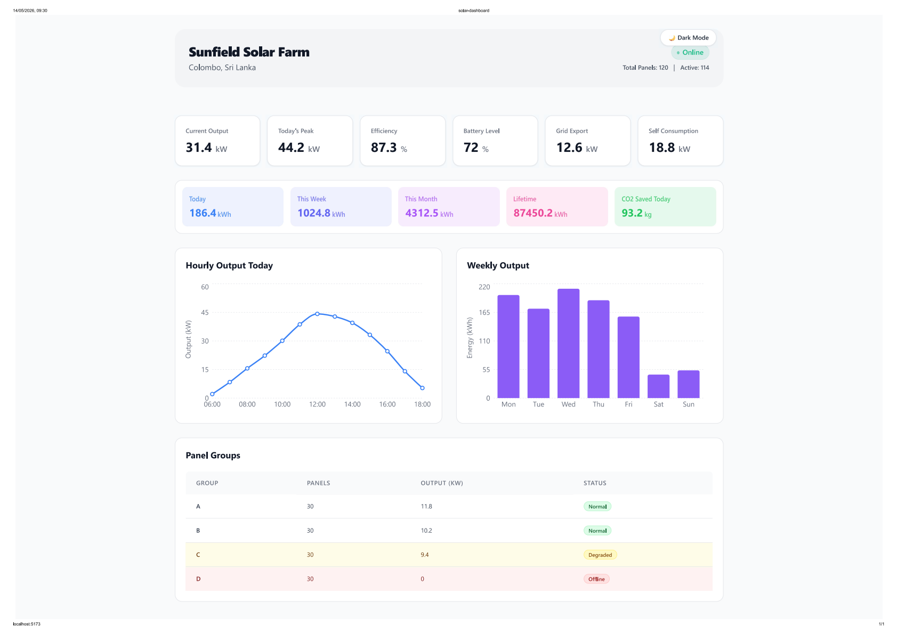
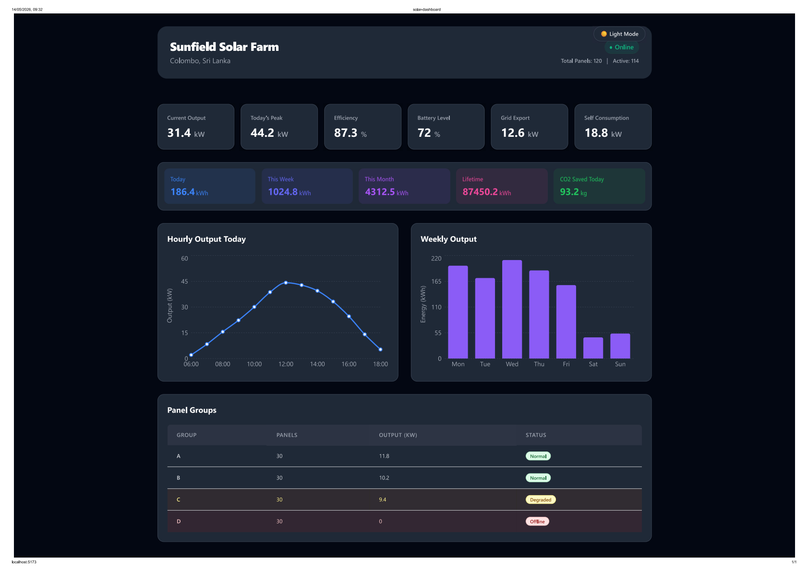

# Sunfield Solar Dashboard

A React-based web dashboard to monitor the status and output of the Sunfield Solar Farm. It provides live statistics, energy summaries, hourly and weekly output charts, and a detailed table of panel group statuses.

## Tech Stack
- React
- Vite
- Tailwind CSS
- Recharts

## How to run
- `git clone <repo>` (or just use the provided directory)
- `cd solar-dashboard`
- `npm install`
- `npm run dev`

## Architectural Decision
The application employs a top-down data flow architecture where all mock data is imported directly into the main `App.jsx` and passed down to individual components via props. This approach keeps the presentation components entirely decoupled from the data source, making them highly reusable and easier to test. If the application later transitions to using a real API, the data fetching logic can be isolated within `App.jsx` (or a dedicated data provider component) without requiring any changes to the UI components themselves.

# My React Project dash board light mode

This is my website preview:

# My React Project dash board dark mode

This is my website preview:

